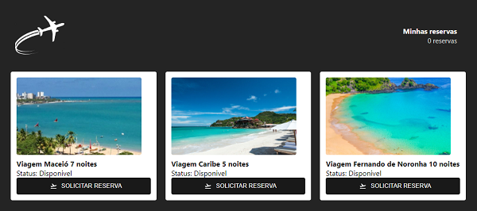
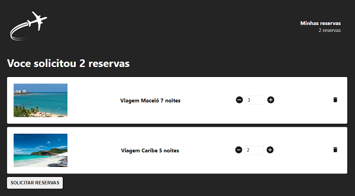

<h1 align="center">Reserva Viagens</h1>

Uma aplicação para reserva de viagens com quantidade podendo ser alterada pelo usuário diretamente na sua lista de reservas.

<p align="center">		
		 
</p>

<p align="center">
	<a href="#computer-tecnologias">Tecnologias</a> •	
	<a href="#white_check_mark-features">Features</a> •
	<a href="#runner-começando">Começando</a> •
	<a href="#warning-pré-requisitos">Pré-requisitos</a> •	
	<a href="#hammer_and_wrench-instalação">Instalação</a> •	
	<a href="#construction_worker-autor">Autor</a> •
	<a href="#memo-licença">Licença</a>
</p>

<p align="center">
	<kbd>
		
	</kbd>
	<br/><br/>
	<kbd>
		
	</kbd>		
</p>

## :computer: Tecnologias 

- [React](https://pt-br.reactjs.org/)
- [Immer](https://immerjs.github.io/immer/)
- [Redux](https://redux.js.org/)
- [Redux-Saga](https://redux-saga.js.org/)

## :white_check_mark: Features

- [x] Lista de Viagens
- [x] Lista de Reservas
- [x] Exclusão de reserva
- [x] Alteração da quantidade de reservas

## :runner: Começando 

Essas instruções fornecerão uma cópia do projeto instalado e funcionando em sua máquina local.

## :warning: Pré-requisitos 

O que você precisar para instalar a aplicação

```
Node >= 10.15.0
```

## :hammer_and_wrench: Instalação

Passos para rodar a aplicação

```
# Clonar
git clone https://github.com/tarcisioaraujo/reserva-viagens.git

# Acessar o diretório
cd reserva-viagens

# Instalar as dependências do Node JS (leva alguns minutos ☕)
npm install

# Rodar servidor React
npm start

# Instalar o simulador de API
npm install -g json-server

# Rodar o simulador de API
json-server server.json -p 3333

# Acessar o endereço 
http://localhost:3000/
```

## :construction_worker: Autor

<a href="https://github.com/tarcisioaraujo">
 
 <br />
 <sub><b>Tarcísio Silva de Araújo</b></sub></a> <a href="https://github.com/tarcisioaraujo" title="GitHub"></a>

Feito por Tarcísio Silva de Araújo 👋

[](https://www.linkedin.com/in/tarcisiosaraujo/) 
[](mailto:tarcisio.saraujo@gmail.com)

## :memo: Licença

Este projeto esta sobe a licença [MIT](./LICENSE).
